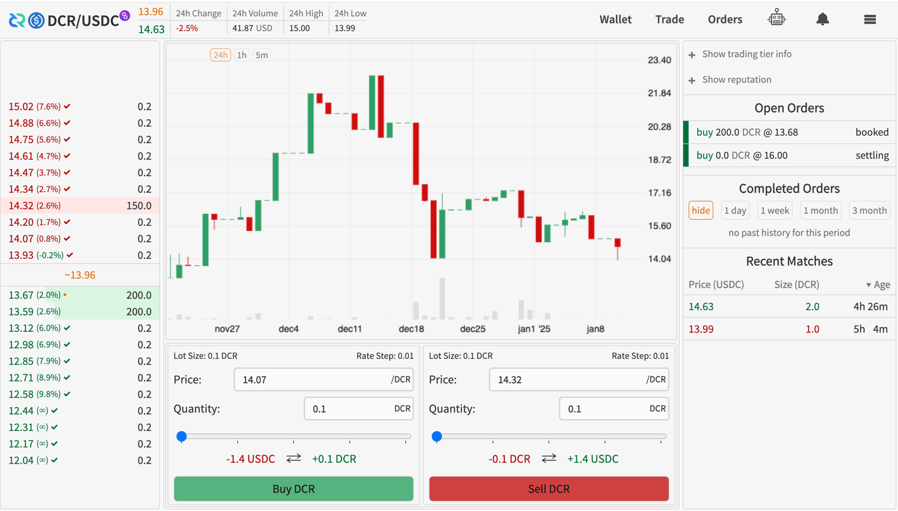

## Bison Lean is crypto-wallet built around atomic-swaps powered DEX

This repository is a fork of [Bison wallet](https://github.com/decred/dcrdex) that prioritizes UX and clean UI. 

## Getting Started

At the moment we don't distribute pre-built binaries, so the only way to run Bison Lean is to build it from source code:
- `git clone` this repository
- install `Golang` and `Node.js` that will be used to compiling & building this code
- build Bison Lean wallet binary by running `make build`
- run Bison Lean wallet binary by running `make run`
- open `127.0.0.1:3333` URL in browser and you are done!
